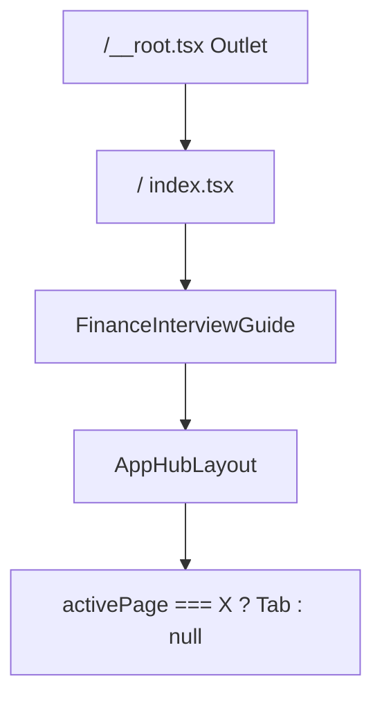

# Perceived loading — splash, tabs, skeletons

## Contexte technique



- **Onglets hub** : pas de routes séparées — bascule via `search.tab` dans [`src/routes/index.tsx`](src/routes/index.tsx) et rendu conditionnel dans [`src/components/FinanceInterviewGuide.tsx`](src/components/FinanceInterviewGuide.tsx) (lignes 71–99). Chaque changement **démonte** l’onglet précédent → flash blanc + perte d’état scroll.
- **Détail question** : accordéon inline dans [`src/components/hub/QuestionsTab.tsx`](src/components/hub/QuestionsTab.tsx) (`expandedQuestion`), données déjà en mémoire. Le délai perçu vient surtout du **rendu synchrone** (long `steps`, composant [`Visual.tsx`](src/components/interview/Visual.tsx) ~1000 lignes).
- **Pas de** composant `Skeleton` ni splash existant ; `tw-animate-css` + `prefers-reduced-motion` déjà gérés dans [`src/styles.css`](src/styles.css).

**Chiffres splash** (dynamiques, pas en dur) : importer `questions`, `MA_DEALS`, `BANK_LIST` comme dans [`AppHubLayout.tsx`](src/components/hub/AppHubLayout.tsx) — ex. « {n} questions », « {n} deals », « {n} banques ».

---

## 1. Splash screen (~800 ms)

### Nouveaux fichiers

- [`src/lib/app-stats.ts`](src/lib/app-stats.ts) — `getAppStats()` + `SPLASH_PHRASES` (rotation : accroche + stats).
- [`src/hooks/useAppSplash.ts`](src/hooks/useAppSplash.ts) — logique :
  - Afficher si `sessionStorage.getItem('fp_splash_seen')` absent (**défaut : une fois par session** ; facile à basculer vers `localStorage` ou chaque load).
  - Durée minimale **800 ms** + barre de progression (easing CSS, pas linéaire brut).
  - Fin quand `min(800ms)` écoulé **et** React monté (`useEffect` ready).
  - `prefers-reduced-motion` ([`src/lib/scroll.ts`](src/lib/scroll.ts)) → skip ou fade 150 ms sans barre animée.
- [`src/components/AppSplash.tsx`](src/components/AppSplash.tsx) — plein écran, fond aligné hub (`from-slate-50 via-blue-50`), logo texte **FinancePrep** (serif + icône `Landmark`/`Sparkles`, pas d’asset logo dédié dans `public/`), phrase avec crossfade 400 ms entre 2–3 lignes pendant le splash, barre `h-1` teintée navy (`blue-900`).

### Intégration

- Envelopper le contenu dans [`FinanceInterviewGuide.tsx`](src/components/FinanceInterviewGuide.tsx) (ou [`RootComponent`](src/routes/__root.tsx) via `ClientOnly`) : tant que `showSplash`, afficher `<AppSplash />` ; sinon hub normal.
- `z-index` élevé, `aria-busy`, pas de scroll body.

---

## 2. Transitions entre onglets hub

### Nouveau composant [`src/components/hub/HubTabPanels.tsx`](src/components/hub/HubTabPanels.tsx)

Remplace le pattern `{activePage === "questions" && <QuestionsTab />}`.

| Mécanisme                 | Détail                                                                                                                                                                 |
| ------------------------- | ---------------------------------------------------------------------------------------------------------------------------------------------------------------------- |
| **Keep-alive**            | `Set<HubNavTab>` des onglets déjà visités ; ne monter qu’au premier accès, puis `hidden` / `inert` + `aria-hidden` quand inactif (évite re-fetch / re-layout complet). |
| **Transition**            | Crossfade **150 ms** par défaut (`opacity` + `transition-opacity` sur panneau actif).                                                                                  |
| **Slide iOS (optionnel)** | Si `tabIndex(new) > tabIndex(old)` → `translateX(8px)` entrant depuis la droite ; sinon depuis la gauche — même durée 150 ms, désactivé si `prefers-reduced-motion`.   |
| **Fond**                  | Wrapper `main` avec `min-h-[50vh]` + fond gradient identique au layout pour éviter le blanc entre panneaux.                                                            |

`progress` reste hors `HUB_NAV_TABS` : rendu séparé sans animation slide (fade simple).

### Fichiers modifiés

- [`src/components/FinanceInterviewGuide.tsx`](src/components/FinanceInterviewGuide.tsx) — passer les 5 onglets + props à `HubTabPanels`.
- [`src/styles.css`](src/styles.css) — utilitaires `@utility tab-panel-enter` / `tab-panel-exit` si besoin (sinon Tailwind `transition-opacity duration-150`).

**Non prévu dans ce lot** : transitions sur routes guide (`/cv`, `/glossaire`, etc.) — autre mécanisme TanStack Router (`pendingComponent`) si besoin ultérieur.

---

## 3. Skeleton — expansion question / concept

### UI de base

- [`src/components/ui/skeleton.tsx`](src/components/ui/skeleton.tsx) — `animate-pulse rounded-md bg-blue-100/80` (pattern shadcn minimal, sans nouvelle dépendance).

### Skeletons métier

- [`src/components/hub/QuestionDetailSkeleton.tsx`](src/components/hub/QuestionDetailSkeleton.tsx) — structure calquée sur le détail dans `QuestionsTab` : bandeau « Explication » + 3 lignes + 2 blocs « étapes » (carré numéro + lignes).
- Réutiliser ou variante légère pour [`ConceptCard`](src/components/interview/ConceptCard.tsx) (titre + 3 lignes).

### Intégration React 19

Dans **QuestionsTab** et **ConceptCard** (ou parent `ConceptsTab` si plus simple) :

```tsx
const [isPending, startTransition] = useTransition();

onClick={() => startTransition(() => setExpanded(id))}

{isExpanded && (
  isPending ? <QuestionDetailSkeleton /> : </* contenu actuel */>}
)}
```

- Conserver `smoothScrollIntoViewAfterLayout` **après** la transition (`useEffect` sur `expanded` + `!isPending`).
- **Optimisation ciblée** : dans le contenu réel, envelopper `<Visual type={...} />` dans `ClientOnly` avec `fallback={<Skeleton className="h-48" />}` pour isoler le coût SVG.

---

## 4. Tests et accessibilité

- Test unitaire [`src/lib/app-stats.test.ts`](src/lib/app-stats.test.ts) — cohérence des compteurs avec les tests data existants ([`ma-deals.test.ts`](src/data/ma-deals.test.ts) « 16 deals »).
- Vérifier manuellement : iOS safe area (déjà sur nav) + splash ne masque pas le focus trap.
- `npm run build` + parcours : cold load → splash → onglets Questions ↔ Notions ↔ Guide sans flash ; expand question lourde avec visual.

---

## Ordre d’implémentation suggéré

1. `skeleton.tsx` + `QuestionDetailSkeleton` (base visuelle)
2. `useTransition` sur QuestionsTab / ConceptCard
3. `HubTabPanels` + refactor FinanceInterviewGuide
4. `AppSplash` + hook + intégration
5. CSS polish + tests
